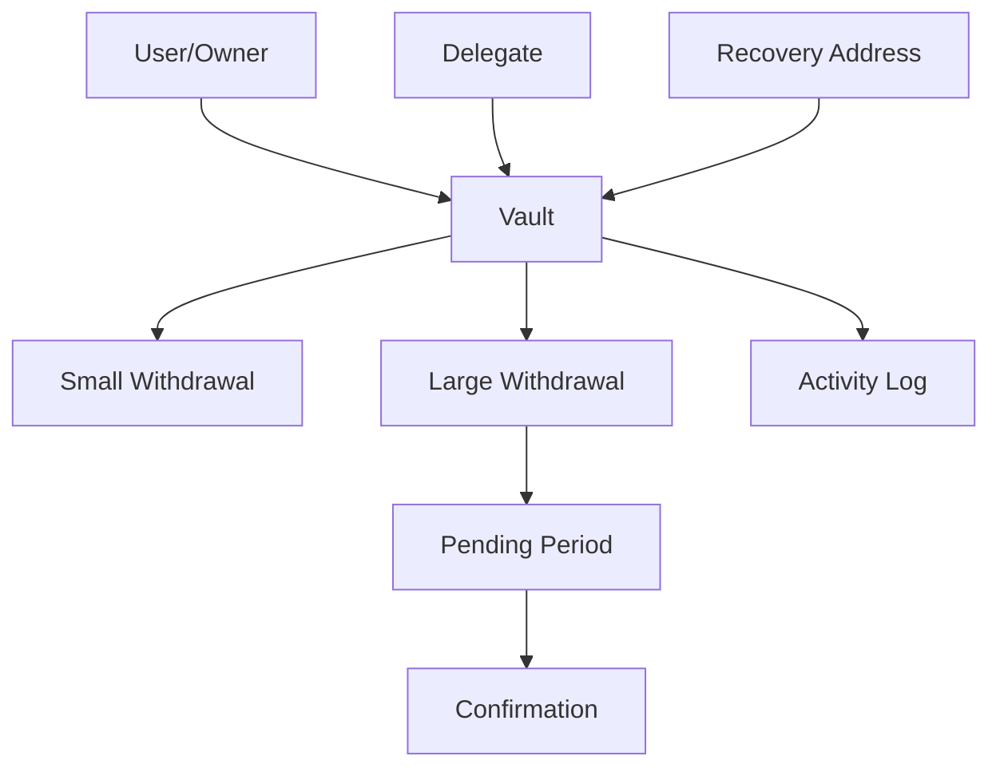

# Secure Asset Vault Manager (VaultTrack)

A secure smart contract solution for managing digital assets on the Stacks blockchain with enterprise-grade security features and flexible access controls.

## Overview

VaultTrack enables users to create personal vaults for storing and managing their STX tokens with advanced security features including:

- Time-locked withdrawals for large transactions
- Configurable daily withdrawal limits
- Delegate access management
- Emergency recovery system
- Comprehensive activity logging
- Multi-signature style controls

The system maintains the benefits of self-custody while providing institutional-grade security controls.

## Architecture



The system is built around individual vaults that support multiple access patterns:
- Direct owner access
- Delegate access with configurable permissions
- Emergency recovery access
- Time-locked operations for large withdrawals

## Contract Documentation

### Vault-Track Contract

The main contract implementing the vault system with the following key components:

#### Access Control Layers
- Owner: Full access to vault operations
- Delegates: Configurable access for deposit/withdrawal/viewing
- Recovery Addresses: Emergency access capabilities

#### Security Features
- Withdrawal Limits: Configurable daily limits for instant withdrawals
- Cooldown Periods: Time-locks for large withdrawals
- Activity Logging: Comprehensive transaction tracking
- Balance Tracking: Real-time balance management

## Getting Started

### Prerequisites
- Clarinet installation
- Stacks wallet for deployment and testing

### Basic Usage

1. Create a new vault:
```clarity
(contract-call? .vault-track create-vault u1000000000 u144)
```

2. Deposit funds:
```clarity
(contract-call? .vault-track deposit tx-sender u1000000)
```

3. Initiate withdrawal:
```clarity
(contract-call? .vault-track initiate-withdrawal tx-sender u500000 recipient-address)
```

## Function Reference

### Core Vault Operations

#### create-vault
```clarity
(define-public (create-vault (withdrawal-limit uint) (cooldown-period uint))
```
Creates or updates a vault with specified limits and cooling period.

#### deposit
```clarity
(define-public (deposit (owner principal) (amount uint))
```
Deposits STX into a vault.

#### initiate-withdrawal
```clarity
(define-public (initiate-withdrawal (owner principal) (amount uint) (beneficiary principal))
```
Initiates a withdrawal, either completing instantly or entering cooldown.

### Delegate Management

#### add-delegate
```clarity
(define-public (add-delegate (delegate principal) (can-deposit bool) (can-initiate-withdrawal bool) (can-view-balance bool) (withdrawal-limit uint))
```
Adds a delegate with specified permissions.

### Recovery Operations

#### add-recovery-address
```clarity
(define-public (add-recovery-address (recovery principal))
```
Configures a recovery address for emergency access.

## Development

### Testing
1. Clone the repository
2. Install dependencies: `clarinet install`
3. Run tests: `clarinet test`

### Local Development
1. Start Clarinet console: `clarinet console`
2. Deploy contracts: `clarinet deploy`

## Security Considerations

### Limitations
- Maximum withdrawal amount: 50,000 STX
- Maximum 5 delegates per vault
- 24-hour cooldown period for large withdrawals

### Best Practices
1. Always verify transaction amounts before confirmation
2. Use multiple recovery addresses for critical vaults
3. Regularly review delegate permissions
4. Monitor vault activity logs
5. Test withdrawal flows with small amounts first

### Emergency Procedures
1. In case of compromise, immediately remove affected delegates
2. Use recovery addresses only as a last resort
3. Keep recovery addresses secure and distributed